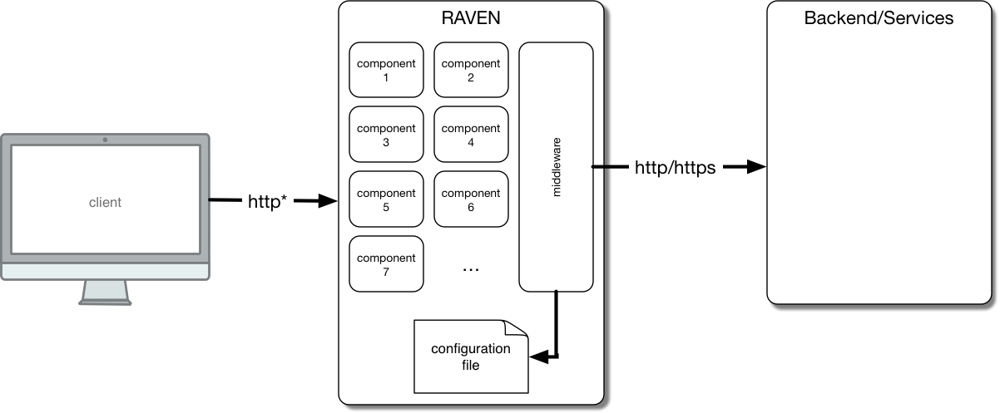

# RAVEN's Product Guide

RAVEN is a web-based platform included in the SEQ subsystem of the Advanced Multi-mission Operations System (AMMOS) and managed by the Multi-mission Ground System and Services (MGSS). It allows users to view science planning, spacecraft activities, resource usage and predicted data, or any time-based data, displayed in a timeline format via web browser. Subsequently, it can be viewed simultaneously by distributed users/teams for collaboration when creating, updating and validating activity plans and command sequences.

| **Property** | **Value** |
| ------------ | --------- |
| Element      | MPSA      |
| Program Set  | SEQ       |
| Version      | 34.8.0    |


[TOC]

## 1 Document Overview

### 1.1             Purpose

The Purpose of this document is to provide a system administrator a quick reference guide to important installation and troubleshooting information. References contained within this document provide guides for installing and configuring RAVEN.

### 1.2             Terminology and Notation

| Term  | Meaning                                    |
| ----- | ------------------------------------------ |
| RAVEN | Resource and Activity Visualization Engine |
| MGSS  | Multi-mission Ground Systems and Services  |
| AMMOS | Advanced Multi-mission Operations System   |
| NPM   | Node Package Manager                       |
| HTML  | Hyper-text Markup Language                 |
| CAM   | Common Access Management                   |
| MPS   | Mission Planning Systems                   |


### 1.3             References

Add references to the following two tables, as necessary. Add revision identifiers, as necessary.

Table 1: Applicable JPL Rules documents

| Title                | DocID |
| -------------------- | ----- |
| Software Development | 57653 |

Table 2: Applicable MGSS documents

| Title                                     | Document Number |
| ----------------------------------------- | --------------- |
| MGSS Implementation and Task Requirements | DOC-001455      |
| The architecture   description document   |                 |
| The software design   document(s)         |                 |
| The software   interface specification(s) |                 |


## 2 Minimum System Requirements

RAVEN is a browser based application, developed using Angular 6 as the framework, HTML and TypeScript. In order for the application to build, the minimum requirements are:

- NodeJS >= 8.9.3
- NPM >= 5.6.0

The application can be served by any web server. Nevertheless, for development purposes a developer should run: 

```shell
npm i 		// Install the dependencies as specified in the {ROOT}/package.json
npm start	// Build the application, start a web server and serve it. 
```

The dependencies are: 

```json
"dependencies": {
  "@angular/animations": "^6.1.9",
  "@angular/cdk": "^6.4.7",
  "@angular/cdk-experimental": "^6.4.7",
  "@angular/common": "^6.1.9",
  "@angular/compiler": "^6.1.9",
  "@angular/core": "^6.1.9",
  "@angular/flex-layout": "6.0.0-beta.18",
  "@angular/forms": "^6.1.9",
  "@angular/http": "^6.1.9",
  "@angular/material": "^6.4.7",
  "@angular/platform-browser": "^6.1.9",
  "@angular/platform-browser-dynamic": "^6.1.9",
  "@angular/router": "^6.1.9",
  "@ngrx/effects": "^6.1.0",
  "@ngrx/router-store": "^6.1.0",
  "@ngrx/store": "^6.1.0",
  "@ngrx/store-devtools": "^6.1.0",
  "@types/file-saver": "^1.3.0",
  "ag-grid-angular": "^19.0.0",
  "ag-grid-community": "^19.0.0",
  "angular-sortablejs": "^2.6.0",
  "angular-split": "^1.0.0-rc.3",
  "core-js": "^2.5.7",
  "file-saver": "^1.3.8",
  "font-awesome": "^4.7.0",
  "hammerjs": "^2.0.8",
  "lodash": "^4.17.11",
  "material-design-icons": "^3.0.1",
  "moment": "^2.22.2",
  "monaco-editor": "^0.14.3",
  "ngx-toastr": "^9.1.0",
  "roboto-fontface": "^0.10.0",
  "rxjs": "~6.2.0",
  "rxjs-compat": "^6.3.3",
  "sortablejs": "^1.7.0",
  "strip-json-comments": "^2.0.1",
  "uuid": "^3.3.2",
  "web-animations-js": "^2.3.1",
  "zone.js": "~0.8.26"
},
```


**Supported Browsers:** 

- Firefox v. 62.x

-  Chrome v. 69.x


## 3 Configuration Information

### 3.1 Basic Configuration

The file [raven2](https://github.jpl.nasa.gov/MPS/raven2)/[src](https://github.jpl.nasa.gov/MPS/raven2/tree/develop/src)/[environments/environment.ts](https://github.jpl.nasa.gov/MPS/raven2/tree/develop/src/environments/environment.ts) contains the current environment settings during the build which is used by default. Nevertheless, if you run `ng build --env=prod` then `environment.prod.ts` will be used instead. The property 'baseUrl' points to the data source provider. 

```json
export const environment = {
  baseUrl: 'https://leucadia.jpl.nasa.gov:9443',
  production: true|false,
};
```


Another important file for configuration settings is under [raven2](https://github.jpl.nasa.gov/MPS/raven2/config.ts)/[src](https://github.jpl.nasa.gov/MPS/raven2/tree/develop/src)/config.ts. This file contains the settings used in the UI, by default, for displaying data. 

```json
raven: {
    defaultBandSettings: {
      activityLayout: 0,
      icon: 'circle',
      iconEnabled: false,
      labelFont: 'Georgia',
      labelFontSize: 9,
      labelWidth: 150,
      resourceColor: '#000000',
      resourceFillColor: '#000000',
      showLastClick: true,
      showTooltip: true,
    },
```

 

The following diagram illustrates how the communication within RAVEN context happens. The client, via a browser, loads RAVEN. Then, RAVEN loads its configuration from a configuration file that permeates to the components loaded. The communication to the backend happens through a middleware layer that packages requests and handles responses. All of this communication happens through http/https. 




*The port used is configured by the user. By default, the port to access RAVEN is 4200. 


### 3.2  Configuration using CAM

Please refer to MPSServer Product Guide. The configuration is set in the server and RAVEN is protected by the server delivering the application to the client's browser. 


## 4 Adaptation

RAVEN is a multi-mission general purpose data visualization tool. It provides a set of components that given a source with pairs of values it will display them in the chosen band by the user. There is no adaptation needed, other than the right configuration to point to the correct MPSServer instance that will supply the data as stored in a datastore by the user. 


## 5 Product Support

### 5.1 Defect Reporting Procedure

To report a defect in RAVEN, a JIRA ticket can be created in the SEQ Support JIRA project, or an email can be sent to [SEQ.support@jpl.nasa.gov](mailto:SEQ.support@jpl.nasa.gov). Within this message the following should be included:

- Title
- Brief Description of the defect and steps to reproduce
- RAVEN Version
- Criticality of the defect

### 5.2 Points of Contact

| Type                | Point of Contact                                             |
| ------------------- | ------------------------------------------------------------ |
| Administration      | Hector Acosta [hector.r.acosta@jpl.nasa.gov](mailto:hector.r.acosta@jpl.nasa.gov) |
| General Help        | Hector Acosta [hector.r.acosta@jpl.nasa.gov](mailto:hector.r.acosta@jpl.nasa.gov) |
| Techincal Questions | Chris Camargo [Christopher.A.Camargo@jpl.nasa.gov](mailto:Christopher.A.Camargo@jpl.nasa.gov) |
|                     | Taifun O'Reilly [Taifun.L.OReilly@jpl.nasa.gov](mailto:Taifun.L.OReilly@jpl.nasa.gov) |
